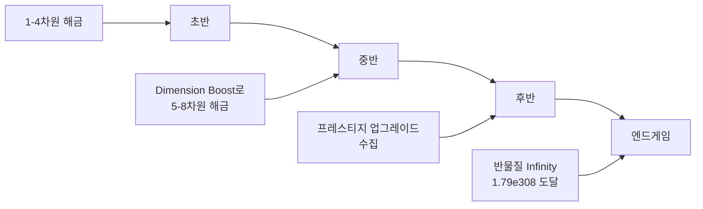

# 🎮 Dimension Idle

[](https://unity.com/)
[](https://docs.microsoft.com/en-us/dotnet/csharp/)
[](https://docs.unity3d.com/Manual/UIElements.html)
[]()
[]()
[](LICENSE)

> **Antimatter Dimensions**에서 영감을 받은 **방치형 증분 게임(Idle/Incremental Game)**입니다.  
> 8개의 차원을 통해 반물질을 **무한대(1.79e308)**까지 생산하는 것이 목표입니다.

<p align="center">
  
</p>

<!-- 🎬 유튜브 영상 링크 삽입 위치
<p align="center">
  <a href="YOUR_YOUTUBE_LINK_HERE">
    
  </a>
</p>
-->

---

## 📋 프로젝트 개요

| 항목 | 내용 |
|------|------|
| **프로젝트 상태** | 🚧 개발 진행 중 |
| **프로젝트 유형** | 개인 프로젝트 |
| **장르** | Idle / Incremental Game |
| **엔진** | Unity 6 (6000.1.2f1) |
| **플랫폼** | PC, Android |
| **개발 도구** | Claude Code (로직), UI Toolkit (UI 직접 제작) |

---

## ✨ 주요 기능

### 🔢 8차원 생산 시스템
- 각 차원이 하위 차원을 생산하는 **연쇄 생산 구조**
- 1차원 → 반물질 생산
- N차원 → (N-1)차원 생산
- **BigDouble** 라이브러리로 1e308+ 초대형 숫자 처리

### ⚡ 틱스피드 (Tickspeed)
- 전체 생산 속도를 증가시키는 핵심 업그레이드
- 구매할수록 비용 증가, 효과 누적

### 🚀 Dimension Boost
- 새로운 차원 해금
- 기존 차원에 **영구 배수** 적용
- 전략적 타이밍이 중요한 핵심 메카닉

### 🔄 프레스티지 시스템
- 진행 상황 리셋 후 **Prestige Points** 획득
- 강력한 영구 업그레이드 구매 가능
- 각 차원별 부스트, 틱스피드 파워, 벌크 보너스 등

### 🛒 프리미엄 상점
- Premium Currency로 영구 부스트 구매
- 차원 1-4, 5-8, 전체 차원 2배 생산 등

### 📴 오프라인 진행
- 접속하지 않아도 자원 축적
- 최대 24시간 오프라인 보상 (업그레이드로 30시간까지 확장)
- 오프라인 효율 업그레이드 (50% → 최대 100%)
- **타임 부스트**: 저장된 오프라인 시간을 배속으로 사용

### 💾 세이브 시스템
- JSON 기반 저장/불러오기
- Export/Import 기능으로 백업 지원

---

## 📱 스크린샷

| Dimensions | Prestige | Options |
|:----------:|:--------:|:-------:|
|  |  |  |

| Shop | Offline Progress |
|:----:|:----------------:|
|  |  |

---

## 🎯 게임 진행 단계



| 단계 | 목표 | 핵심 전략 |
|------|------|----------|
| **초반** | 1~4차원 해금 | 틱스피드 투자 |
| **중반** | 5~8차원 해금 | Dimension Boost 활용 |
| **후반** | 프레스티지 업그레이드 수집 | 효율적인 리셋 타이밍 |
| **엔드게임** | Infinity (1.79e308) 도달 | 상점 + 오프라인 최적화 |

---

## 🛠️ 기술 스택

### Game Engine & Language
| 기술 | 용도 |
|------|------|
| **Unity 6** | 게임 엔진 |
| **C#** | 게임 로직 |
| **UI Toolkit (UXML/USS)** | UI 시스템 (직접 제작) |

### Core Systems
| 시스템 | 설명 |
|--------|------|
| **BigDouble** | 1e308+ 초대형 숫자 연산 |
| **JSON Serialization** | 세이브/로드 시스템 |
| **Singleton Pattern** | 매니저 클래스 아키텍처 |
| **Universal Render Pipeline** | 렌더링 파이프라인 |

### Development Tools
| 도구 | 용도 |
|------|------|
| **Claude Code** | AI 페어 프로그래밍 (로직 개발) |
| **UI Toolkit** | UI 레이아웃 및 스타일링 |

---

## 🏗️ 시스템 아키텍처

```
┌─────────────────────────────────────────────────────────┐
│                      GameManager                        │
│              (중앙 게임 루프 & 상태 관리)                  │
└─────────────────────┬───────────────────────────────────┘
                      │
        ┌─────────────┼─────────────┬─────────────┐
        ▼             ▼             ▼             ▼
┌──────────────┐ ┌──────────────┐ ┌──────────────┐ ┌──────────────┐
│ DimBoost     │ │ Prestige     │ │ TickSpeed    │ │ Offline      │
│ Manager      │ │ Manager      │ │ Manager      │ │ Manager      │
└──────────────┘ └──────────────┘ └──────────────┘ └──────────────┘
        │             │             │             │
        └─────────────┴─────────────┴─────────────┘
                      │
                      ▼
┌─────────────────────────────────────────────────────────┐
│                     UIManager                           │
│           (UI Toolkit 기반 화면 제어)                     │
├─────────────┬─────────────┬─────────────┬──────────────┤
│ Dimensions  │  Prestige   │   Options   │    Shop      │
│   Panel     │   Panel     │   Panel     │   Panel      │
└─────────────┴─────────────┴─────────────┴──────────────┘
                      │
                      ▼
┌─────────────────────────────────────────────────────────┐
│                    SaveManager                          │
│              (JSON 기반 데이터 영속성)                    │
└─────────────────────────────────────────────────────────┘
```

---

## 📁 프로젝트 구조

```
📁 Unity_DimensionIdle_Game/
├── 📁 Assets/
│   ├── 📁 Scripts/               # C# 게임 로직
│   │   ├── 📄 GameManager.cs           # 중앙 게임 루프
│   │   ├── 📄 DimensionsPanelController.cs
│   │   ├── 📄 PrestigePanelController.cs
│   │   ├── 📄 PrestigeManager.cs
│   │   ├── 📄 DimBoostManager.cs
│   │   ├── 📄 TickSpeedManager.cs
│   │   ├── 📄 OfflineManager.cs
│   │   ├── 📄 SaveManager.cs
│   │   ├── 📄 BigDouble.cs             # 대형 숫자 처리
│   │   └── ...
│   │
│   ├── 📁 UI/                    # UI Toolkit 리소스
│   │   ├── 📁 UXML/             # UI 레이아웃
│   │   └── 📁 USS/              # 스타일시트
│   │
│   ├── 📁 Scenes/
│   │   └── 📄 SampleScene.unity
│   │
│   └── 📁 Resources/             # 게임 리소스
│
├── 📁 Packages/                  # Unity 패키지
├── 📁 ProjectSettings/           # 프로젝트 설정
├── 📄 README.md
└── 📄 진행상황.md                 # 개발 로그
```

---

## 🚀 실행 방법

### 사전 요구사항
- Unity 6 (6000.1.2f1) 이상
- Universal Render Pipeline (URP)

### 설치 및 실행

```bash
# 1. 레포지토리 클론
git clone https://github.com/jjkkhh123/Unity_DimensionIdle_Game.git

# 2. Unity Hub에서 프로젝트 열기
# 3. Scenes/SampleScene.unity 열기
# 4. Play 버튼 클릭
```

### Android 빌드
1. File → Build Settings → Android 선택
2. Player Settings에서 패키지명 설정
3. Build and Run

---

## 🎮 조작법

| 조작 | 설명 |
|------|------|
| **차원/업그레이드 버튼** | 클릭하여 구매 |
| **Max 버튼** | 최대 수량 구매 |
| **Until 10 버튼** | 10개 단위로 구매 |
| **하단 탭** | 화면 전환 (Dimensions / Prestige / Options / Shop / Offline) |

---

## 📍 개발 현황

### ✅ 구현 완료
- [x] 8차원 생산 시스템
- [x] 틱스피드 업그레이드
- [x] Dimension Boost
- [x] 프레스티지 시스템 및 업그레이드
- [x] 프리미엄 상점
- [x] 오프라인 진행 시스템
- [x] 세이브/로드 시스템
- [x] 멀티탭 UI (UI Toolkit)
- [x] 모바일 대응 UI

### 🚧 개발 예정
- [ ] Infinity 시스템 (1.79e308 도달 후 콘텐츠)
- [ ] 도전 과제 시스템
- [ ] 통계 패널
- [ ] 사운드 및 BGM
- [ ] 파티클 이펙트
- [ ] 추가 프레스티지 레이어

---

## 💡 확장 가능성

| 확장 방향 | 설명 |
|----------|------|
| **Infinity 레이어** | 무한대 도달 후 새로운 프레스티지 계층 |
| **도전 과제 시스템** | 특정 조건 달성 시 보상 |
| **자동화 시스템** | 자동 구매, 자동 프레스티지 |
| **클라우드 세이브** | Firebase 연동 멀티 디바이스 지원 |
| **리더보드** | 글로벌 랭킹 시스템 |
| **다크 모드** | UI 테마 변경 |

---

## 📚 참고 자료

- [Antimatter Dimensions (Original)](https://ivark.github.io/) - 원작 게임
- [Unity UI Toolkit Documentation](https://docs.unity3d.com/Manual/UIElements.html)
- [Incremental Game Design Patterns](https://gamedesignconcepts.wordpress.com/)

---

## 📄 라이선스

MIT License

> ⚠️ 본 프로젝트는 **Antimatter Dimensions**에서 영감을 받은 팬 프로젝트입니다.  
> 원작 게임의 모든 크레딧은 원 제작자에게 있습니다.

---

## 👤 개발자

**이진수** | [GitHub](https://github.com/jjkkhh123) | [Portfolio](https://jjkkhh123.github.io/profile/)

---

<!-- 
📌 TODO: 유튜브 영상 업로드 후 아래 내용 수정
1. 상단 주석 처리된 유튜브 섹션의 주석 해제
2. YOUR_YOUTUBE_LINK_HERE를 실제 링크로 교체
3. VIDEO_ID를 실제 영상 ID로 교체 (썸네일용)
-->
